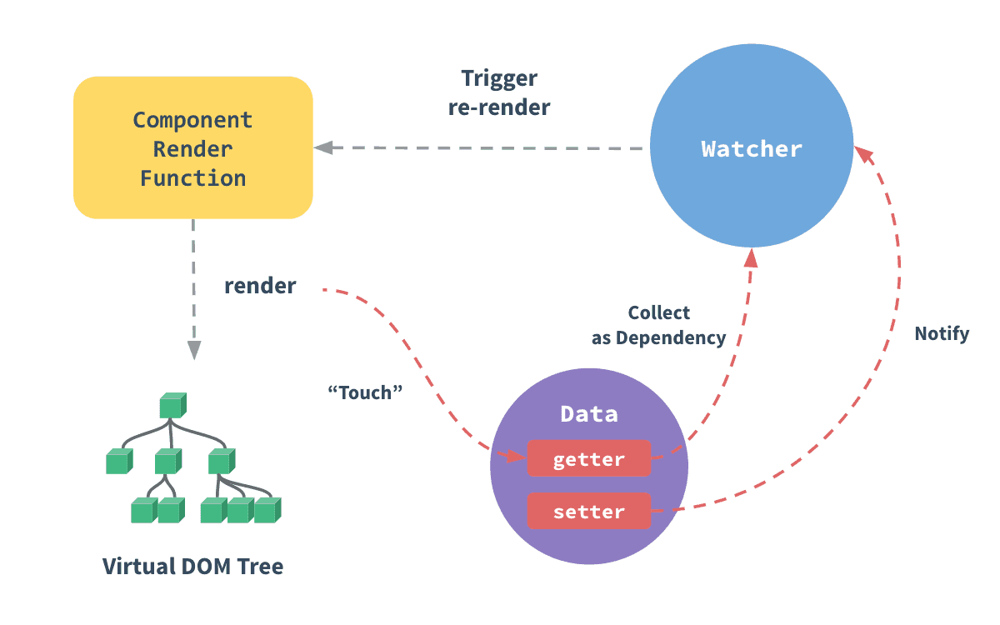

本文是对 FrontendMaster - Advanced Vue.js Features from the Ground Up 第二章 Reactivity 总结。

本章旨在解释 vue 的响应式原理。

在 vue 文档中有这张图



大概解析了 vue 的响应式原理，但是比较粗浅，在 reactivity 中，Evanyu 深入解析了具体 vue 是怎么实现实例的响应式的。

首先，vue 中用到了一个 api Object.defineProperty 这个 api 无法向下兼容，导致 vue 在 ie8 及往下的版本都无法使用 vue。

具体实现中，每个 components 实例都拥有自己的 data，props 或者是 computed 或 watched，这些属性在实例化的时候都会经过一个 observe 函数进行转化。

```javascript
// 简单 observe
function observe(obj) {
  Object.keys(obj).forEach(key => {
    let value = obj[key]
    Object.defineProperty(obj, key, {
      get() {
        return value
      },

      set(newValue) {
        value = newValue
      },
    })
  })
}
```

这是响应式的关键，通过重置变量的 setter 和 getter，可以重置变量的值，指向，实现响应式。但是这还不够，这样并不能实现所谓了响应式。

例如在 vue 中

```javascript
data() {
  return {
    a: 1;
  }
},
computed() {
  b () { return a + 1; }
}
```

光凭借简单的 observe，computed 的值无法随着 a 的更新而更新，因为 setter 和 getter 暂时只影响当前值，没办法更新依赖它的值。

所以正确的思路应该是在 getter 中添加依赖，并且能在调用 setter 时找到该依赖，并更新依赖它的值。

为此，新增一个 Dep class

```javascript
window.Dep = class Dep {
  constructor() {
    this.subscribers = new Set()
  }

  depend() {
    if (activeUpdate) {
      this.subscribers.add(activeUpdate)
    }
  }

  notify() {
    this.subscribers.forEach(subscriber => {
      subscriber()
    })
  }
}

function observe(obj) {
  Object.keys(obj).forEach(key => {
    let dep = new Dep()
    let value = obj[key]
    Object.defineProperty(obj, key, {
      get() {
        dep.depend()
        return value
      },

      set(newValue) {
        value = newValue
        dep.notify()
      },
    })
  })
}

let activeUpdate

function autorun(update) {
  function wrapperUpdate() {
    activeUpdate = wrapperUpdate
    update()
    activeUpdate = null
  }

  wrapperUpdate()
}
```

至此，一个简单的响应式框架就做好了，这里重点关注 getter 依赖添加，activeUpdate 和 Dep 是如何将 update 函数添加到订阅器上的。由于 js 的单线程，js 每次只能运行一个函数，activeUpdate 会在进行 autorun 时记录当前 autorun 的 update。vue 中 update 的代码会运行在 autorun 下。

```javascript
// example
const state = { count: 0 }

autorun(() => {
  console.log(state.count)
})
```

调用 autorun 后在 update 内部使用了 state.count，触发了依赖，当前 update 函数就会添加到 subscribers 上

给予一个简单的 sample observer

从写一个更复杂的 observe 函数，使之可以很好的识别 data

```javascript
function observe(obj) {
  if (obj.hasOwnProperty("data")) {
    const data = obj.data()
    Object.keys(data).forEach(key => {
      let value = data[key]
      let dep = new Dep()
      Object.defineProperty(obj, key, {
        get() {
          dep.depend()
          return value
        },

        set(newValue) {
          value = newValue
          dep.notify()
        },
        enumerable: true,
      })
    })
    delete obj.data
  }
}
```

测试样例

```javascript
const state = {
  data() {
    return {
      a: 1,
    }
  },
}

observe(state)
console.log(state) // { a: [Getter/Setter] }
autorun(() => {
  console.log(state.a)
})
```

此代码第一次运行时返回 1，是 a，b 的值，当 state.a 重新赋值时，update 再次运行 返回 3。这意味这当 state 被改变时，会触发 update 函数，如果在 update 中添加改变视图的方法，例如 document.getElement(‘div‘).text = state.a; state 的改变则会驱动视图变化，perfect。这就是 vue 的响应式原理。
