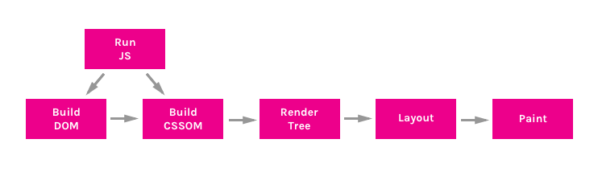
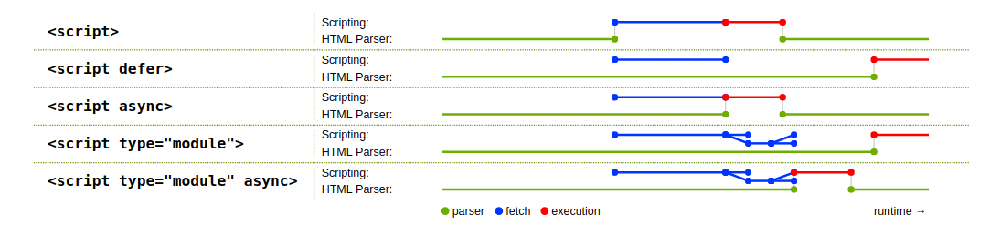

- [Google DeveloperCRP 系列文章](https://developers.google.com/web/fundamentals/performance/critical-rendering-path/)

- 和上面文章同一作者的 Udacity 课程：[网站性能优化](https://classroom.udacity.com/courses/ud884)

- CRP 详述：[understanding critical render path | bitofcodes](https://bitsofco.de/understanding-the-critical-rendering-path/)

- async 和 defer javascipt 在 CRP 理论下的分析：[Asynchronous vs Deferred JavaScript](https://bitsofco.de/async-vs-defer/)

- `<script>`标签位置方案详述：[Deep dive into the murky waters of script loading](https://www.html5rocks.com/en/tutorials/speed/script-loading/)

## quick quiz

Q：请简述 critical render path。

A：在浏览器请求资源的时候，最先请求到的一定是一个 html 文件，所有的其他资源一定是围绕这个入口进行加载的。关键渲染路径就在于浏览器加载其他资源和构建相关模型以及渲染到屏幕的策略。

一个正常的 CRP 包含以下步骤：

1. 构建 DOM

2. 构建 CSSOM

3. 运行 JavaScript 脚本

4. 创建渲染树

5. 生成布局

6. 绘制画面



一般而言，这个过程是顺序执行的，唯一需要关注的，是 JavaScript 如何影响 DOM 和 CSSOM 的构建。

JavaScript 是一种解析阻塞的资源。一旦 html 解析器遇到一个 script 标签，它将会立即加载并执行脚本，同时 blocking html parser。而且，script 还可能会改变一些样式，这意味着，脚本将会在 CSSOM 构建完毕后才会执行。这里有一篇参考文章：[使用 JavaScript 新增互動功能](https://developers.google.com/web/fundamentals/performance/critical-rendering-path/adding-interactivity-with-javascript)。

关键路径决定了页面将会如何呈现到客户端，并决定了呈现的速度。关键路径的优化则会影响页面首次加载的性能。

一般而言，首次加载的性能瓶颈一般是在网络上和解析上。加载资源的顺序和速度会直接影响首次加载的性能。所以对于如何优化关键路径，可以分为两大类：1、尽早加载网页关键资源，例如关键
CSS 和关键 JS。2、优化可能产生阻塞的代码，例如 js 运行阻塞 dom 构建等。

Q：简述 async 脚本的执行路径。

A：async 是 HTML5 的提案，目的是防止阻塞 dom 构建，async 脚本将会并行 dom 构建进行加载，并且在加载完毕后立刻执行。



Q：简述 defer 脚本的执行路径。

A：如上图，defer 一样可以并行 dom 构建加载，并会在 dom 构建完毕后立刻执行。

Q：为什么要使用 async 和 defer，它们又有什么问题。

A：async 和 defer 的都是为了防止原始脚本标签阻塞 dom 构建而提出的，并行加载可以让他们更快地加载。但是同样，他们两者也有问题。第一、async 和 defer 都无法保证脚本的执行一致性。

例如一下代码

```html
// async提案
<script async src="1.js">
<script async src="2.js">
// defer提案
<script defer src="1.js">
<script defer src="2.js">
```

async 在这种代码中，无法保证 1.js 运行在 2.js 之前，defer 则会在某些浏览器中存在 bug 导致 2.js 部分代码可能提前与 1.js。致使两个脚本无法顺序运行。defer 提案由于严重的 bug，现在几乎不会用了。async 则只会使用在独立的，关键的脚本之上。

Q：请比较 async 和 defer 异同。

A：上面说的也很详细，async 和 defer 都能并行于 parser 加载，不同是 async 会在加载完成时执行，defer 则在 dom 构建完成时执行。

Q：如何应用 CRP 分析加快网站的加载速度。

A：上面也说到过，关键在于如何尽早地加载关键资源和防止阻塞 dom 构建。

能用的策略包括：

1. 最小化、压缩、缓存关键资源。

2. 最小化渲染阻塞资源。

   - 使用 media query 防止加载非关键 CSS

   - 使用 inline CSS

3. 最小化解析阻塞资源。

   - 推迟 JavaScript 执行

   - 异步加载 JavaScript

Q：综述 script 标签放置问题。

A：[https://www.html5rocks.com/en/tutorials/speed/script-loading/#toc-enough](https://www.html5rocks.com/en/tutorials/speed/script-loading/#toc-enough)自己看吧。
