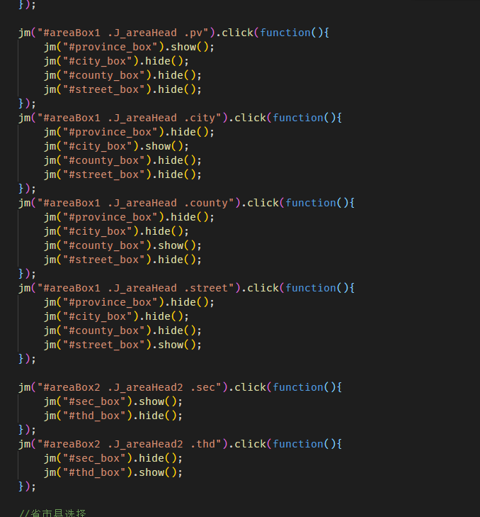
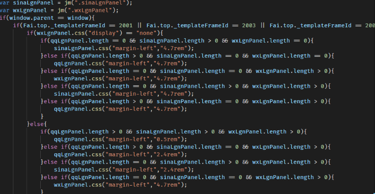
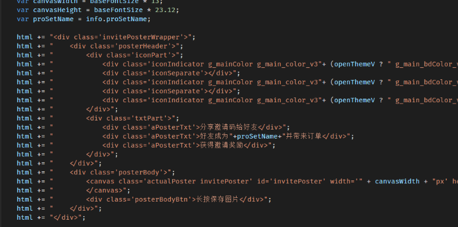
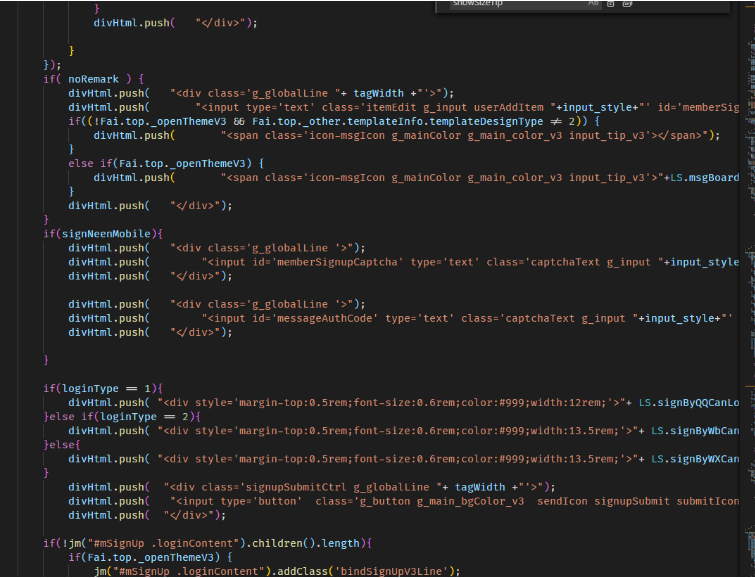
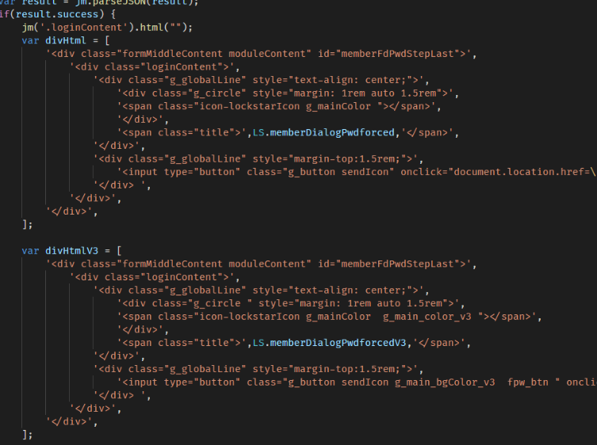
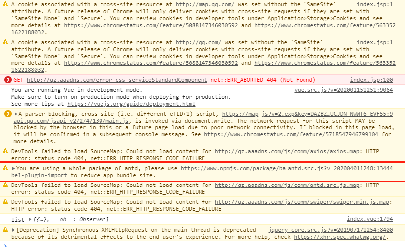

在这里对在工作中的项目中看不惯的代码进行集中吐槽, 批斗.

## Common 通病

1. svn base 项目管理, 没有分支, 所有人都在同一条主分支上开发, 极度残忍. 没有 code review 也不需要, 因为没有分支合并.
2. 代码没有 format 直接提交, 这点尤其无语, 经常打开文档会出现空格, tab 混用的代码, 代码一长一短的, 实在寒心.
3. global css 落后 gulp 打包. 全局污染非常严重.
4. js 依然有落后 gulp 打包, 全局变量特别多, 依赖打包顺序. 按道理模块规范何其多, 但我们任性一个也不用.
5. 过于简单的 workflow, 没有讨论的空间, 不需要 review, 基本我提交项目就照单全收.
6. iframe base 调优困难, 重复引入依赖.
7. 没有调优的概念, 能用就行.
8. 重复造轮子, 造劣质轮子直接用于项目. 为什么不优先考虑行业成熟方案.我觉得是看的少, 不知道有成熟方案.
9. 也是因为自己造轮子, 特质化, 没有标准. 引入方案困难.
10. 没有注释标准. 反正想怎么写就怎么写, 更多的是直接不写, jsDoc 了解一下?
11. 大量 hard coding, 纯手写 url, 不会用变量来管理吗\
12. css 命名混乱, 有使用 camelCase 的, 有使用 snake 的, 有使用 underscore 的,

## Mobi

1. 粗暴迭代, 直接创建新文件

请看新时代 coding 风格, 面向复制新文件的编程风格. 需求风格 2.0 => 3.0 直接每个模块复制一段新的代码到 xxxV3.jsp.inc. 跟接着同样新赠 xxxV3.src.css, 维护水平指数上升, 极具文艺复兴特质. 在代码中到处可以看到 if(...ThemeV3) 的代码复用字样. 估计也是因为 2.0 代码太捞, 没办法实现 3.0 功能. 另 3.0 的主开发已经离职, 牛逼. 所以直接搞一套新的.虽然我目前写的代码也是面向复制新文件. 后面会再说到.

1. 文艺复兴系列之 jquery

大量代码逻辑依赖 jQuery, 依赖于视图层. 就问你敢不敢动 dom 结构. 我感情 5, 6 年前没有 vue react angular. 前端的框架不是还有 ember 之流? 怎么想到直接一把梭子就是干?

给各位欣赏一下面向 jq 的响应式编程

1. 面向拼接字符串的前端模板编程.

   

我丢, 即便上个年代上模板引擎他不香吗. pug, handlebar, 那样是上个年代没有的, 即便在 java 端也有相应的模板引擎. 你直接给我 srcipt.append 是要玩什么? 拼接模板就拼接模板吧, 你能不能对齐? 来看看各种风格

实在是让人赏心悦目

## Qz PC & Mall PC

1. 引入整个 antd bundle

   

   明明在 console 已经说了不要引入整个 antd 包, 但是依然整个包引入了. 公司原本使用自己的组件库, 貌似放弃了, 转而使用 antd-vue 了. 之后应该自己魔改了. 不过看了看 antd-vue 的代码貌似是全程使用 render + jsx. 这魔改难度略大. 毕竟这个 antd-vue 的版本就是 antd 魔改出来的.

2. 全局风格

   全局风格的实现在我看来也是相当下饭的操作. 使用内联 style 的架构. 风格效果全靠覆盖. 怎么, 大家是没听过 css-in-js 还是咋地. 以后每新建一个模块都要使用 window.globalcolor 来设置颜色和其他东西. 我谢谢你.

3. 没有使用任何 state management 框架, 改数据全靠在全局变量上改.

   我...都上 vue 了, 上 vuex 能把你咋地. 导致代码耦合已经相当严重. 到处都引用全局变量卧槽. 当然在其他项目这个也中招了. 数据保护不存在的, 想怎么改就怎么改.

4. utils 只有一个文件, 目前已超过 10000+行. utils 和 api 全放这了, 这个文件能不大? 另外作为 utils 函数你不注释, 你是写给自己用的吗

## Qz 小程序

迭代有些问题, 版本管理不是很明确, 这玩意在手机中常常会占用非常多的内存, 常常一打开就飙到 600m+, 要知道小程序的上限貌似只有 1G. 没仔细研究过代码, 按道理说不应该能占用这么多内存的. 可能是因为大量的 component 创建导致的. 另外需求也是不是很合理, 例如视频列表, 地图列表等, 其实是不应该可以插入多个这样的模块的. 这个项目 api 编写不是很规范, 而且里面有些异步代码没有回调, 没有考虑到连锁的异步场景, 典型的是登录的模块, 代码那是比较不科学. 状态管理的缺失也导致我开发全局订阅事件这样的库. 里面很多黑科技. 不过在公司众多项目中代码算是比较中规中矩了.
