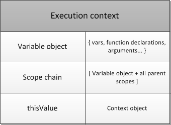
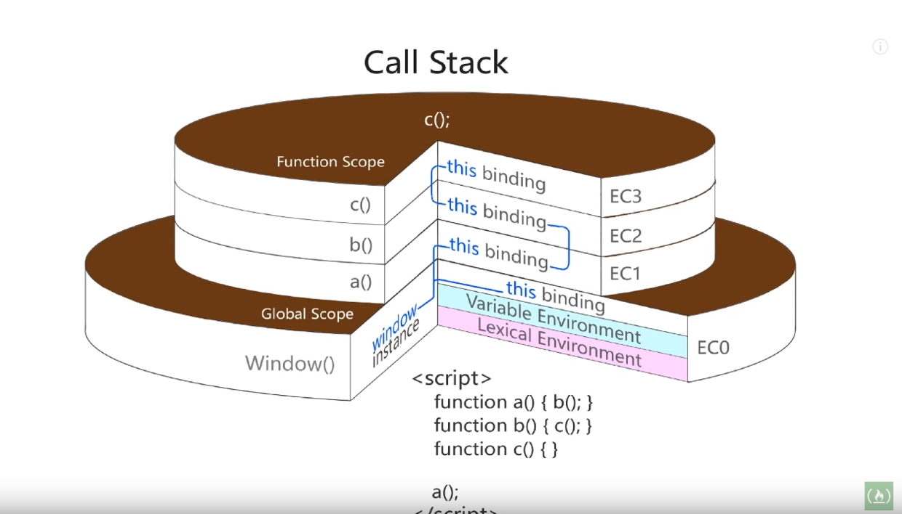

在学习 JavaScript 的时候出现很多难以理解的概念，例如闭包，回调，this，作用域，作用域链，执行环境等等。但是这些概念难懂，归根到底都是对 call stack 模型的把握太差。只要理解好 JavaScript 调用栈模型，所有这些问题概念对会很容易解决。

这里贴上 youtube 上对于 call stack 解释非常好的视频[JavaScript Foundations: Execution Context and Call Stack](https://www.youtube.com/watch?v=jTGb4t31vCY)，以及一篇绝世神文[JavaScript. The Core](http://dmitrysoshnikov.com/ecmascript/javascript-the-core/)，这位作者 Dmitry Soshnikov 的[博客](http://dmitrysoshnikov.com/)也是干货满满，对一些 JavaScript 的基础概念都有深入的讲解，而且覆盖面非常全。

## 执行环境（execution context）

执行环境是 javascript 中很重要的概念，它定义了变量和函数有权访问的其他数据，决定了他们各自的行为。与之关联的是一个变量对象（variable object）。

一个执行环境的变量对象定义了以下这些属性：

- 作用域链（Scope Chain）：定义了当前上下文的作用域链。

- 变量环境（Variable Environment）:定义了当前上下文中所有变量。

- this 绑定（this Binding）：定义了当前上下文 this 的绑定。

这里概念在 ES5，ES6 出现了一些变化，详细可以看[JavaScript. The Core: 2nd Edition](http://dmitrysoshnikov.com/ecmascript/javascript-the-core-2nd-edition/#execution-context)

## 调用栈（call stack or execution stack）

调用栈是程序运行的一个很重要的概念，如果不是很清楚可以先看一下[The Call Stack](https://www.youtube.com/watch?v=Q2sFmqvpBe0&t=299s "The Call Stack")这个视频，里面也详实解释到包括 C 或汇编运行时的调用栈情况。

在 javascript 上这个情况要更复杂一些，它使用到一种叫环境栈的结构，一个函数调用压栈时，同时也会生成该函数的执行环境，进入环境栈。

实际情况中，当一个函数 caller 调用一个 callee 时，会根据 caller 传递的参数初始化 arguments 变量和 callee 本身的 local variable 生成一个变量对象（activation object），这个变量对象是就是新的 execution context 的 variable object。

同时会生成一个 scope chain，scope chain 的一种链表结构，在创建时会拿取 caller 的 execution context 中的 Scope chain，而后把自己的 variable object 加到链表头部。当前 context 的 Scope chain 则指向此链表头。其实说到底，Scope chain 就是 variable object chain，其中没有什么特别难理解的。这样形成的 Scope chain 符合词法作用域的特点。

最后再在环境栈压入当前执行环境，至此完成整个入栈过程。出栈就不多说了，无非就是销毁执行环境，然后出栈。这样整个执行环境栈模型大致叙述完毕。有了这套模型，其实很多 JavaScript 的难点都迎刃而解了。

## this binding

javascript 最令人迷惑的一个变量就是 this 指针了。很多人对各种 this 绑定云里雾里，不知其解。理解 this，最重要的其实还是要知道 javascript 根本没有 this 变量。

其实很多人的对接触 this 都是从 c++或 java 等 OOP 中来的。javascript 对 this 的处理和他们区别很大。在 c++的 class 模型中，this 是作为一个隐藏指针，传递给 methods 的，也就是说每个 methods 都会拿到一个 this 变量，作为自己的 local variable。而且，他们的 method 不会像句柄一样传来传去，所以也导致这些 this 比较容易理解。

然而在 JavaScript 中，function 的中是没有名为 this 的变量的，所有的 this，都是引用当前顶层 execution context 的 this。也就是说，理解 this 是 context 的 property 而不是 variable object 的 property 这一点很重要。

> NOTE: 在 ese6 中确实有了 lexical environment this，以支持 arrow function。

关于 this binding 继承自父 context 还是辅以其他值，可以看另一篇文章[ECMA-262-3 in detail. Chapter 3\. This.](http://dmitrysoshnikov.com/ecmascript/chapter-3-this/)

## 动态作用域

虽然 JavaScript 使用的是词法作用域，但是它提供一些方法去添加当前 context 的 scope chain 头部。例如 with 或 catch 块。不多说。

## 闭包和回调

回调就是闭包的应用，就不说了。闭包的实现在闭包的函数中具有一个[[scope]]的属性用于保存父 Scope chain。最重要是 JavaScript 的垃圾回收机制不会回收这些被引用的 variable object，虽然父级 context 可能被销毁（例如在异步回调之前，外部函数已调用完毕，它的 context 自然销毁了），但是在[[scope]]属性 Sc 链表中所引用 variable object 是不会销毁的。这就是闭包。当闭包被调用的时候，会生成新的 context，而后会将 context 的 Scope chain 初始化为 actived object + [[scope]]，这样，闭包就可以访问到它父 Scope 的变量了。

值得注意的是[[scope]]是在函数创建的时候就初始化好了，而并不是在调用的时候初始化。所以其实所有的函数，都是闭包。
