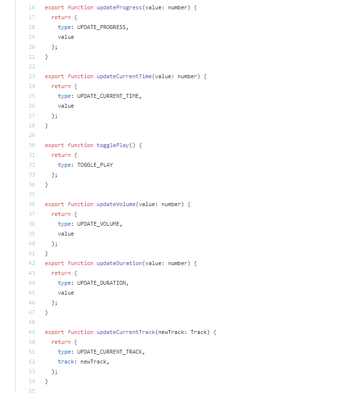

## store

### 结构与命名

一个项目的 store 最好放在一个 store 文件夹下集中管理, 当这不是绝对的, 我见过以页面组织 store 的用法. 但是如果想让你的 store 能再所有地方方便地引用到, 最好还是集中到 store 文件夹下.

而命名最好带有明确意义的名词 例如 user.js, menu.js, session.js 等, 避免出现意义不明或者使用动词来命名. store 一般指名实体的数据, 同时也避免缓存函数, 递归等. 应当作为一个 json-like 的结构来使用, 这会使得你的 app 在现在和将来更快和更好优化.

[Faster apps with JSON.parse (Chrome Dev Summit 2019)](https://www.youtube.com/watch?v=ff4fgQxPaO0)

### 形式

这里想先谈一谈 flux 和 redux.

redux 作为官方指定 store 方案和 flux 实现, 是有他的过人之处的.

flux 的架构说白了就是为了单向数据流.

为了实现这种单向数据流, 其实我认为它的核心是思想是, 只有 action 能引起 store 的变化, 而只有 store 变化才会触发 view 变化. flux 本身架构是非常优秀的, 围绕 flux 也有很多实现, vue 基于这种思想也造了 vuex 的轮子. 不过问题是, 围绕剥离 action, store, dispatch 之间需要大量的模板代码.

围绕 action 的构建需要大量的代码, 下面我在 react-redux 的一个练手项目写的代码, 为了剥离实际行为和 action type 而引入的 actionCreator 我认为是一种糟粕.

-1597999422534.png)而 reduce 的方案也不是那么尽人意, 通过比对 action.type 来决定实际 sate 的改变, 似乎又是另一种模板代码. 围绕只是想改变一个值做了那么多工作, 实在让人心寒. 说实话 redux 一直给我一种理念高大上, 效果很一般的感觉. 可能我从未真正需要 redux

---

It is natural to compare Redux to an approach that doesn’t require “boilerplate” code to update the state, and to conclude that Redux is just complicated. In a way it is, and by design so.

[You Might Not Need Redux](https://medium.com/@dan_abramov/you-might-not-need-redux-be46360cf367)

---
