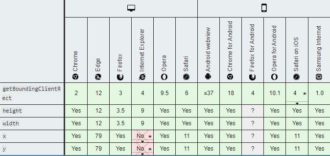
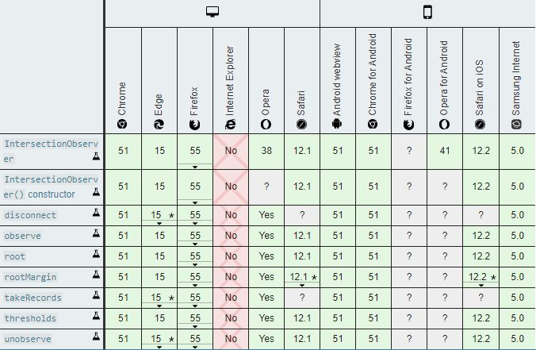
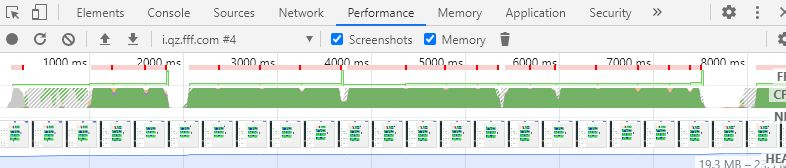
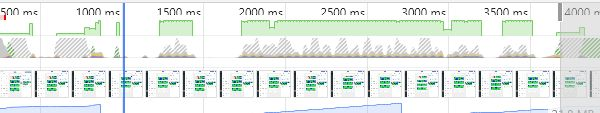

## 前言

在部分场景下, 设计器可能会在滚动过程中造成严重影响体验的卡顿[【pc--页面滚动到一个放了十几张超过 1m 的图片的多图文模块时就会卡顿】](https://www.tapd.cn/30747598/bugtrace/bugs/view?bug_id=1130747598001029787)在本次案例中, 将针对多图文模块进行优化, 希望通过这次优化, 提供普适的解决方案.

## 图片懒加载

图片懒加载应该是非常常用的技术, 目前的技术方案大概有原生 onscrll + 类 getBoundingClientRect api(如 offsetTop, clentHeight)之类的, 第二种是使用 IntersectionObserver API.

### 原生 onscroll + 类 getBoundingClientRect api

优点是各浏览器支持良好, 缺点也很明显, 这类计算位置的 api 会导致回流, 强制重绘, 可能造成页面闪烁, 并且可能引起额外的卡顿, 必须通过节流等手段降低调用频率.



### IntersectionObserver

[Intersection Observer](https://developer.mozilla.org/zh-CN/docs/Web/API/Intersection_Observer_API) API 提供了一种异步观察目标元素与祖先元素或顶级文档[viewport](https://developer.mozilla.org/zh-CN/docs/Glossary/Viewport)的交集中的变化的方法。利用这个 api 可以实现懒加载. 优点是使用浏览器的 api, 只有回调的部分是在主线程运行, 更快更高效. 缺点是在 IE 和低版本 Safari 支持不佳. 当然为了支持低版本, w3c 提供了 polyfill https://github.com/w3c/IntersectionObserver/tree/master/polyfill



## 方案

在目前的解决方案中, 使用的是 IntersectionObserver 的方案,并且不带 polyfill, 因为造成卡顿的主要原因并不是图片有没有使用懒加载. 而且 polyfill 本身可能引入额外的开销和性能问题, 在权衡下, 这次方案中没有加入 polyfill, 也没有加入 polyfill 的规划.实现懒加载的代码位于 editor.js/plugins/lazyload.

## 如何使用

### 普通

由于在本次实现中引入了一个专门处理设计器#miniApp(目前只支持主页, 自定义页)的图片懒加载指令 v-mp-lazy, 只需要在要使用懒加载的 img 标签或其他标签(默认转化为 style:backgroundImage)添加 v-mp-lazy="<your image src>" 指令即可使用懒加载. 和小程序一样, 这个懒加载是上下一屏, 总共 3 屏的加载.

```html
<div class="image-wrapper" v-mp-lazy="https://abcde.com/abcd.jpg"></div>
```

### 进阶

你可能会有特殊的需求, 例如在一个#miniApp 下的一个滚动列表使用懒加载, 这时候, 你需要直接调用 v-lazy-contianer 这个指令, 这个指令可以帮助将这个 container 标记一个父容器. 在他里面的懒加载容器需标记为 v-lazyload. 其实会发现 v-mp-lazy 也是用这种方式实现的, 在 plugins/lazyload/install.js 里同样定义了一个 v-mp-lazy-container 指令以标记父容器.

```html
// parentContainer.vue
<div
  class="parent-container"
  v-lazy-container="{
  name: <your container name>,
  options: <ObserverOptions without root>
}"
></div>
// childContainer.vue
<div
  class="child-container"
  v-lazyload="{ name: <name>, src: <your image src> }"
></div>
```

然后你会发现什么都不会发生, 因为这部分逻辑还没实现, 你可以按照这个接口的模式, 在 plugins/lazyload/install.js 文件下完成你的实现:)

如果上面的形式满足不了你(例如无法标记父容器), 你也可以使用编程式完成懒加载, 具体 api 可以参考 plugins/lazyload/lazyload.js 下的注释

```vue
// example // parentContainer.vue
<script>
import { LazyLoad } from "plugins/lazyload";
	somefuncition() {
    window._lazyload = new LazyLoad({ dataSrc: "data-sth-src" });
    window._lazyload.startObserve({
      root: $("#parent-container"),
      rootMargin: "200px 0px",
      threshold: 0,
    })
}
</script>

// childContainer.vue
<div class="#child=container">
  <div class="image-wrapper" data-sth-src="https://abcd.com/abcd.jpg"></div>
</div>
<script>
somefuncition() {
   window._lazyload.addTarget($("#child-container .image-wrapper"));
}
</script>
```

使用这个方法的重点在于, 必须保证在调用相关方法时父容器或子容器已经插入都 dom 中, 否则将无法完成 observe, 另外 lazyload 实例的生成也要考虑到, 最重要的是, 你可能需要手动调用 Lazyload.removeTarget, LazyLoad.destroy 以避免可能存在的内存泄漏. 不过 startObserve 和 addTarget 的调用时机就没有什么考究, 因为 LazyLoad 里面使用了 cache, 所以即便在 observer 未生成时你也可以将观察对象加进去.

## 渲染

设计器卡顿的主要原因应当是页面渲染问题. 我测试用到的是 7 张 5000px × 5000px 的图片, 每张的图片只有 100k 左右, 在页面滚动的时候, 可以看到, 主线程几乎被绘制合成过程塞爆, 鉴于我每张图片其实很小, 所以其实和图片大小是没什么关系的, 主要是因为图片像素大, 绘制合成层时间长导致的主线程阻塞.

### 

通过添加 translateZ 黑魔法, 这个属性可以提升这些图片层级, 强制使用 GPU 来渲染这图层, 所以也会导致更快的渲染, 并且不会阻塞主进程.

当然你也可以把[will-change](https://developer.mozilla.org/zh-CN/docs/Web/CSS/will-change)加上, 但是这个属性我控制不好, 可能会导致负优化, 没加.

```css
.image-wrapper {
  transform: translateZ(0);
}
```

### 

这种方法只是一种 hack, 并不代表这个属性可以滥用, 最好的方法还是使用缩略图.

## one more thing

本次提交中有一个 mpImage 组件, 位于/components/mpImage/, 这个组件的本意是保持和小程序`<image>`的同构实现的, 这次也将其中的懒加载换成 v-mp-lazy. 总之将他当成小程序的`<image>`标签使用即可

```vue
// mode
<mp-image src="http://abcde.com/abcd.jpg" mode="aspectFill"></mp-image>
// lazyload
<mp-image src="http://abcde.com/abcd.jpg" lazy-load></mp-image>
```

## 参考

[Intersection Observer - Web API 接口参考| MDN](https://developer.mozilla.org/zh-CN/docs/Web/API/IntersectionObserver)

[IntersectionObserver 和图片懒加载 - 知乎专栏](https://zhuanlan.zhihu.com/p/94426820)

[image | 微信开放文档 - 微信开放社区 - 腾讯](https://developers.weixin.qq.com/miniprogram/dev/component/image.html?search-key=lazy-load)

[tuupola/lazyload: Vanilla JavaScript plugin for ... - GitHub](https://github.com/tuupola/lazyload)

[hilongjw/vue-lazyload: A Vue.js plugin for lazyload ... - GitHub](https://github.com/hilongjw/vue-lazyload)

[坚持仅合成器的属性和管理层计数 - google developers](https://developers.google.com/web/fundamentals/performance/rendering/stick-to-compositor-only-properties-and-manage-layer-count?hl=zh-cn)

[用 CSS 开启硬件加速来提高网站性能- 掘金](https://www.google.com/url?sa=t&rct=j&q=&esrc=s&source=web&cd=&ved=2ahUKEwi-jfyYydjpAhXQyosBHWB0AiAQFjAJegQIBxAB&url=https%3A%2F%2Fjuejin.im%2Fpost%2F5bdd9c506fb9a049f069b296&usg=AOvVaw1c_843nYCbOK9AGG39Ks5W)

[详谈层合成（composite） - 掘金](https://juejin.im/entry/59dc9aedf265da43200232f9)

[浏览器层合成与页面渲染优化](https://juejin.im/post/5da52531518825094e373372)

[On translate3d and layer creation hacks - aerotwist](https://aerotwist.com/blog/on-translate3d-and-layer-creation-hacks/)https://medium.com/@dan_abramov/you-might-not-need-redux-be46360cf367)
