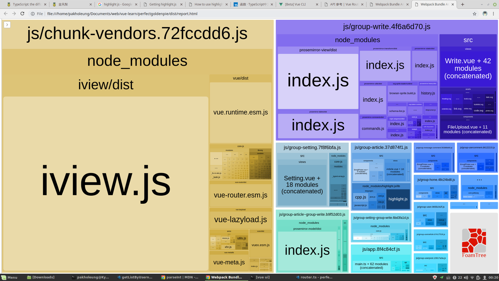
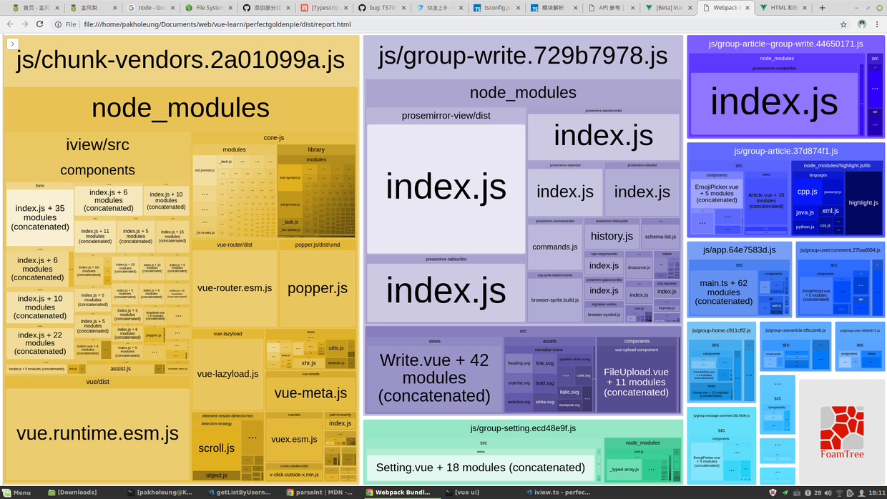
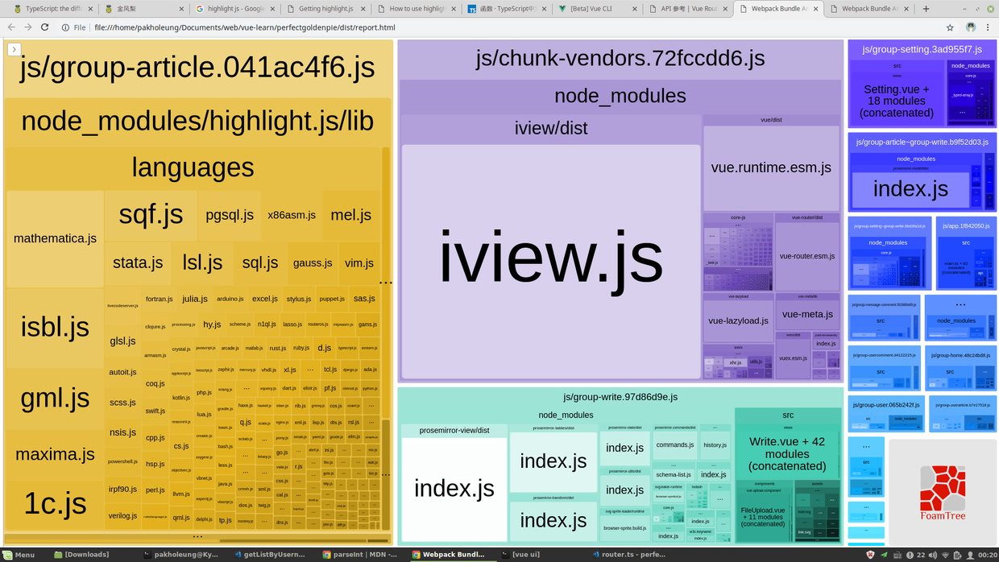
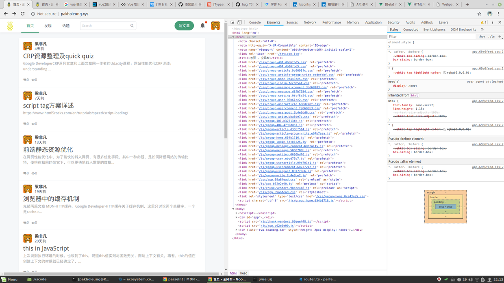

这次优化主要是针对站点首屏加载资源过多，拖慢首屏渲染而做出的优化尝试。

主要手段包括：

1、按需引入 iview，现在所有使用的 components 都要手动引入。

2、删除 prefetch 链接。具体参考[vue-cli prefetch 一节](https://cli.vuejs.org/zh/guide/html-and-static-assets.html#prefetch)。

3、gzip 压缩。

4、按需引入 highlight.js

使用 Lighthouse 测试后会发现在首页测试中，performance 一项的得分由原来的 22 上涨到 88 分。效果也是比较好的。

## 按需引入 ivew

相关记录在项目 plugins/iview 文件，现在需要手动导入所需 components

## 删除 prefetch

原来的策略会尽早 fetch 所有的 js 和 css，这不是我想要的，所以我通过 vue 文档中的 prefetch 一节，删除掉 prefetch 链接。

## gzip 压缩

通过在服务器配置 gzip 选项，压缩 1k 以上的 ascii 文档。配置/etc/nginx/nginx.conf 中 gzip 等选项可以做到。

接下来可以尝试使用 cdn 和 cache-control，加速站点。
